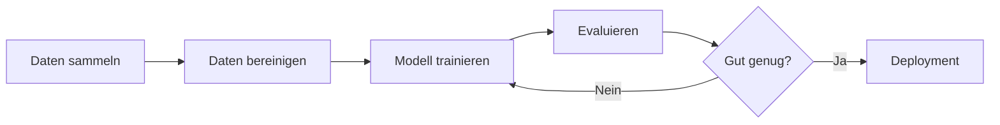

# KI-Schulung Template

Professionelle Präsentationsvorlage für Erwachsenenbildung

<div class="pt-12">
  <span @click="$slidev.nav.next" class="px-6 py-3 rounded cursor-pointer bg-primary text-white hover:bg-secondary transition-all">
    Präsentation starten →
  </span>
</div>

<div class="abs-br m-6 flex gap-2">
  <a href="https://github.com/slidevjs/slidev" target="_blank" alt="GitHub" title="GitHub"
    class="text-xl slidev-icon-btn opacity-50 !border-none !hover:text-white">
    <carbon-logo-github />
  </a>
</div>

---
layout: center
class: text-center
---

# Inhaltsverzeichnis

Übersicht aller verfügbaren Folientypen

<Toc minDepth="1" maxDepth="2" />

---
layout: section
---

# 1. Content Slide
Bullet-Points mit Icons und Animationen

---

# Content Slide Beispiel

<ContentSlide
  title="Vorteile von KI in der Bildung"
  :animated="true"
  :items="[
    { icon: '🎯', text: 'Personalisiertes Lernen für jeden Teilnehmer' },
    { icon: '⚡', text: 'Effiziente Wissensvermittlung durch adaptive Systeme' },
    { icon: '📊', text: 'Datenbasierte Lernfortschrittskontrolle' },
    { icon: '🤝', text: 'Unterstützung der Lehrenden, nicht Ersatz' },
    { icon: '🌍', text: 'Zugänglichkeit und Skalierbarkeit' }
  ]"
/>

---
layout: section
---

# 2. Comparison Slide
Gegenüberstellung mit positiven/negativen Punkten

---

# Vergleich: Traditionell vs. KI-gestützt

<ComparisonSlide
  title="Lernmethoden im Vergleich"
  leftTitle="Traditionelles Lernen"
  rightTitle="KI-gestütztes Lernen"
  :leftItems="[
    { text: 'Einheitliches Tempo für alle', positive: false },
    { text: 'Standardisierte Inhalte', positive: false },
    { text: 'Bewährte Methoden', positive: true },
    { text: 'Persönlicher Kontakt', positive: true }
  ]"
  :rightItems="[
    { text: 'Individuelles Lerntempo', positive: true },
    { text: 'Adaptive Inhalte', positive: true },
    { text: 'Technologieabhängigkeit', positive: false },
    { text: '24/7 Verfügbarkeit', positive: true }
  ]"
/>

---
layout: section
---

# 3. Accordion Slide
Aufklappbare Kategorien für detaillierte Informationen

---

# Themenübersicht: KI-Grundlagen

<AccordionSlide
  title="Kernbereiche der Künstlichen Intelligenz"
  :allowMultiple="false"
  :items="[
    {
      title: 'Machine Learning',
      icon: '🤖',
      content: 'Algorithmen, die aus Daten lernen und Vorhersagen treffen können, ohne explizit programmiert zu werden. Umfasst überwachtes, unüberwachtes und verstärkendes Lernen.'
    },
    {
      title: 'Natural Language Processing',
      icon: '💬',
      content: 'Verarbeitung und Verstehen menschlicher Sprache. Ermöglicht Chatbots, Übersetzungen und Textanalysen.'
    },
    {
      title: 'Computer Vision',
      icon: '👁️',
      content: 'Bildverarbeitung und -erkennung. KI kann Objekte identifizieren, Gesichter erkennen und visuelle Inhalte analysieren.'
    },
    {
      title: 'Deep Learning',
      icon: '🧠',
      content: 'Neuronale Netzwerke mit vielen Schichten. Grundlage moderner KI-Systeme wie GPT, DALL-E und andere generative Modelle.'
    }
  ]"
/>

---
layout: section
---

# 4. Quiz Slide
Interaktive Quizfragen mit Feedback

---

# Wissenstest: KI-Grundlagen

<QuizSlide
  question="Was ist der Hauptunterschied zwischen Machine Learning und traditioneller Programmierung?"
  hint="Denken Sie an die Art, wie Regeln definiert werden"
  :options="[
    {
      text: 'Machine Learning ist schneller',
      isCorrect: false,
      explanation: 'Geschwindigkeit ist nicht der Hauptunterschied. ML kann sogar langsamer sein.'
    },
    {
      text: 'ML lernt Muster aus Daten, statt Regeln explizit zu programmieren',
      isCorrect: true,
      explanation: 'Genau! ML-Systeme lernen aus Beispielen und erkennen Muster selbstständig, während traditionelle Programme mit festgelegten Regeln arbeiten.'
    },
    {
      text: 'ML benötigt keine Daten',
      isCorrect: false,
      explanation: 'Im Gegenteil: ML ist sehr datenabhängig und benötigt oft große Datenmengen zum Training.'
    },
    {
      text: 'ML kann nur mit Zahlen arbeiten',
      isCorrect: false,
      explanation: 'ML kann mit vielen Datentypen arbeiten: Text, Bilder, Audio, Video und mehr.'
    }
  ]"
/>

---
layout: section
---

# 5. Branch Slide
Fallunterscheidungen und Szenarien

---

# Entscheidungsbaum: KI-Projektumsetzung

<BranchSlide
  title="Welchen KI-Ansatz wählen?"
  centralQuestion="Welches Problem möchten Sie lösen?"
  :branches="[
    {
      condition: 'Textanalyse / Chatbot',
      icon: '💬',
      result: 'Natural Language Processing (NLP) mit Transformers wie GPT oder BERT verwenden'
    },
    {
      condition: 'Bilderkennung',
      icon: '📸',
      result: 'Computer Vision mit CNNs (Convolutional Neural Networks) einsetzen'
    },
    {
      condition: 'Vorhersage / Klassifikation',
      icon: '📊',
      result: 'Supervised Learning mit klassischen ML-Algorithmen (Random Forest, XGBoost)'
    },
    {
      condition: 'Mustererkennung in Daten',
      icon: '🔍',
      result: 'Unsupervised Learning mit Clustering-Algorithmen nutzen'
    }
  ]"
/>

---
layout: section
---

# 6. Code Example Slide
Code-Beispiele mit Erklärungen

---

# Python Beispiel: Einfaches ML-Modell

<CodeExampleSlide
  title="Scikit-learn Classification"
  language="python"
  explanation="Dieses Beispiel zeigt ein einfaches Machine Learning Modell mit Scikit-learn. Wir trainieren einen Decision Tree Classifier auf dem Iris-Datensatz und machen Vorhersagen."
  :code="`from sklearn import datasets
from sklearn.model_selection import train_test_split
from sklearn.tree import DecisionTreeClassifier

# Daten laden
iris = datasets.load_iris()
X = iris.data
y = iris.target

# Daten aufteilen
X_train, X_test, y_train, y_test = train_test_split(
    X, y, test_size=0.3, random_state=42
)

# Modell trainieren
clf = DecisionTreeClassifier()
clf.fit(X_train, y_train)

# Vorhersage
accuracy = clf.score(X_test, y_test)
print(f'Genauigkeit: {accuracy:.2%}')`"
/>

---
layout: two-cols
---

# Zwei-Spalten Layout

Ideal für Vergleiche oder ergänzende Inhalte

## Linke Seite

- Punkt 1
- Punkt 2
- Punkt 3

<v-click>

### Animation möglich

Inhalte können nacheinander erscheinen

</v-click>

::right::

## Rechte Seite

```python
# Code-Beispiel
def hello_world():
    print("Hello!")
```

<div v-click class="mt-4 p-4 bg-blue-50 rounded">
💡 Tipp: Kombinieren Sie Text und Code für maximale Klarheit
</div>

---
layout: center
class: text-center
---

# Web Embed Beispiel

<WebEmbedSlide
  title="Live Demo"
  url="https://docs.python.org"
  height="500px"
  :allowInput="false"
/>

---
layout: image-right
image: https://images.unsplash.com/photo-1677442136019-21780ecad995?w=800
---

# Bild-Layout

Kombinieren Sie Text mit aussagekräftigen Bildern

- **Visuell ansprechend**
- **Unterstützt die Botschaft**
- **Professionelle Ästhetik**

<v-click>

<div class="mt-8 p-4 bg-white/80 backdrop-blur rounded-lg">
✨ Bilder sollten hochauflösend und lizenzfrei sein
</div>

</v-click>

---

# Code mit Syntax Highlighting

Slidev unterstützt automatisches Syntax-Highlighting:

```typescript {all|2|4-6|8-10|all}
// TypeScript Beispiel
interface User {
  name: string
  age: number
  email: string
}

function greetUser(user: User): string {
  return `Hallo ${user.name}!`
}
```

<arrow v-click="[3, 4]" x1="400" y1="320" x2="230" y2="370" color="#953" width="2" arrowSize="1" />

<v-click at="3">

Pfeile und Annotationen sind möglich!

</v-click>

---

# Animationen mit v-click

Elemente nacheinander einblenden:

<v-clicks>

- Erster Punkt erscheint
- Dann der zweite
- Und schließlich der dritte
- **Hervorhebungen** funktionieren auch

</v-clicks>

<v-click>

<div class="mt-8 p-4 bg-gradient-to-r from-blue-500 to-purple-600 text-white rounded-lg">
🎯 Animationen helfen, Aufmerksamkeit zu lenken
</div>

</v-click>

---

# Inline Markdown Komponenten

<div class="grid grid-cols-2 gap-4">

<div v-click>

## Markierungen

You can mark <span v-mark.red="1">specific text</span> or even 
<span v-mark.circle.orange="2">circle things</span>!

</div>

<div v-click>

## Mathematik

Inline: $E = mc^2$

Block:

$$
\frac{d}{dx}\int_{a}^{x} f(t)dt = f(x)
$$

</div>

</div>

---
layout: center
class: text-center
---

# Integrierte Vue-Komponenten

<div class="flex justify-center gap-4 mt-8">
  <Counter :count="5" />
  <Counter :count="10" />
</div>

<div class="mt-8 text-gray-600">
Alle Vue-Komponenten aus dem /components Ordner sind automatisch verfügbar
</div>

---

# Shiki Magic Move

Code-Transformationen animiert darstellen:

````md magic-move {lines: true}
```js
// Schritt 1: Einfache Funktion
function calculate(a, b) {
  return a + b
}
```

```js
// Schritt 2: Mit Typ-Prüfung
function calculate(a, b) {
  if (typeof a !== 'number' || typeof b !== 'number') {
    throw new Error('Nur Zahlen erlaubt')
  }
  return a + b
}
```

```ts
// Schritt 3: TypeScript
function calculate(a: number, b: number): number {
  return a + b
}
```
````

---

# Diagramme mit Mermaid



<div class="mt-4 p-4 bg-blue-50 rounded">
💡 Mermaid ermöglicht Flowcharts, Sequenzdiagramme und mehr direkt in Markdown
</div>

---

# Icons und Emojis

<div class="grid grid-cols-3 gap-8 text-center">

<div v-click>
<div class="text-6xl mb-2">🎯</div>
<div class="font-semibold">Fokus</div>
</div>

<div v-click>
<div class="text-6xl mb-2">⚡</div>
<div class="font-semibold">Performance</div>
</div>

<div v-click>
<div class="text-6xl mb-2">🚀</div>
<div class="font-semibold">Innovation</div>
</div>

<div v-click>
<div class="text-6xl mb-2">🎨</div>
<div class="font-semibold">Design</div>
</div>

<div v-click>
<div class="text-6xl mb-2">📊</div>
<div class="font-semibold">Analytics</div>
</div>

<div v-click>
<div class="text-6xl mb-2">🤝</div>
<div class="font-semibold">Zusammenarbeit</div>
</div>

</div>

---
layout: quote
---

# "KI ist nicht die Zukunft der Bildung, sie ist die Gegenwart."

Anonym

---
layout: center
class: text-center
---

# Zusammenfassung

<div class="grid grid-cols-2 gap-8 mt-8 text-left">

<div v-click>

### ✅ Vorteile dieser Vorlage

- Apple-inspiriertes Design
- 12+ Folientypen
- Voll responsiv
- Exportierbar als PDF/HTML

</div>

<div v-click>

### 🎯 Ideal für

- KI-Schulungen
- Erwachsenenbildung
- Technische Präsentationen
- Workshops

</div>

</div>

---
layout: center
class: text-center
---

# Vielen Dank!

Fragen? Feedback?

<div class="mt-8">
  <a href="mailto:info@ki-schulungen.de" class="text-blue-600 hover:underline">
    info@ki-schulungen.de
  </a>
</div>

<div class="abs-br m-6 text-sm text-gray-500">
  Erstellt mit Slidev
</div>

---
src: ./pages/multiple-entries.md
---
